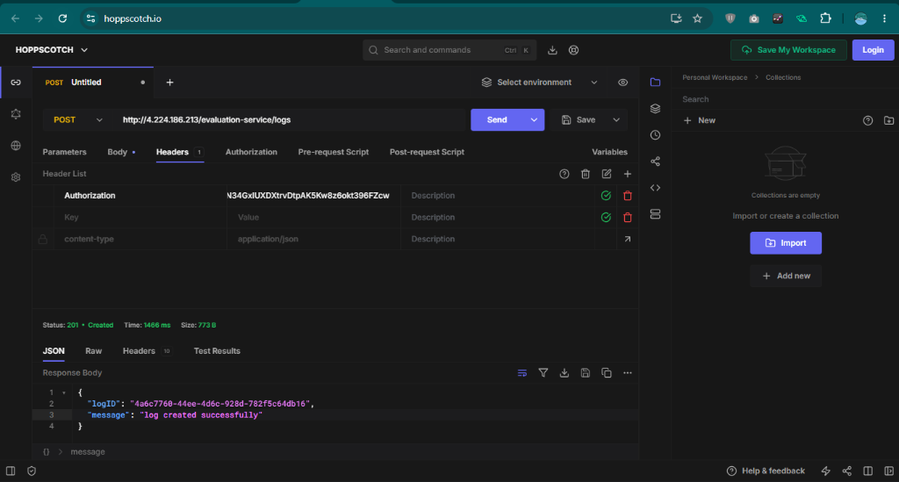
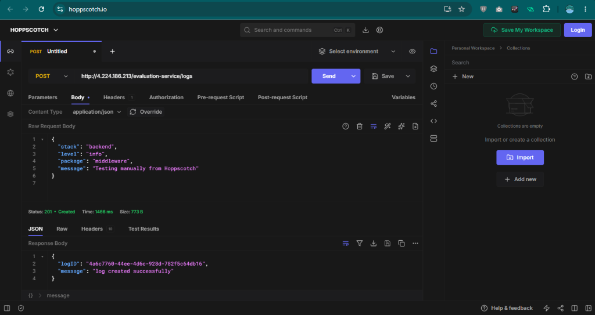

# Campus Evaluation Backend Projects

This repository contains the backend projects for the evaluation test:
1. **logging-middleware**: Reusable logging module.
2. **notification-app-be**: Backend service for managing and logging notifications.
3. **vehicle-scheduler-be**: Backend service for vehicle scheduling and booking.

---

## 🛠️ How to run:

1. Configure the `.env` file in `notification-app-be` and `vehicle-scheduler-be` folders with your credentials:
```env
PORT=3001
EMAIL=your_email
NAME=your_name
ROLL_NO=your_roll_number
ACCESS_CODE=your_access_code
CLIENT_ID=your_client_id
CLIENT_SECRET=your_client_secret
```

2. Install dependencies in the logging middleware and both projects:
```bash
cd logging-middleware
npm install

cd ../notification-app-be
npm install

cd ../vehicle-scheduler-be
npm install
```

3. Run the servers:
```bash
# In notification-app-be directory
node server.js

# In vehicle-scheduler-be directory
node server.js
```

---

## 📸 Test Logs Output

Here are the details and screenshots of the manual test logs sent using Hoppscotch:

### Raw JSON Response Output
```json
{
  "logID": "4a6c7760-44ee-4d6c-928d-782f5c64db16",
  "message": "log created successfully"
}
```

### Log Headers Setup


### Log Response Success


